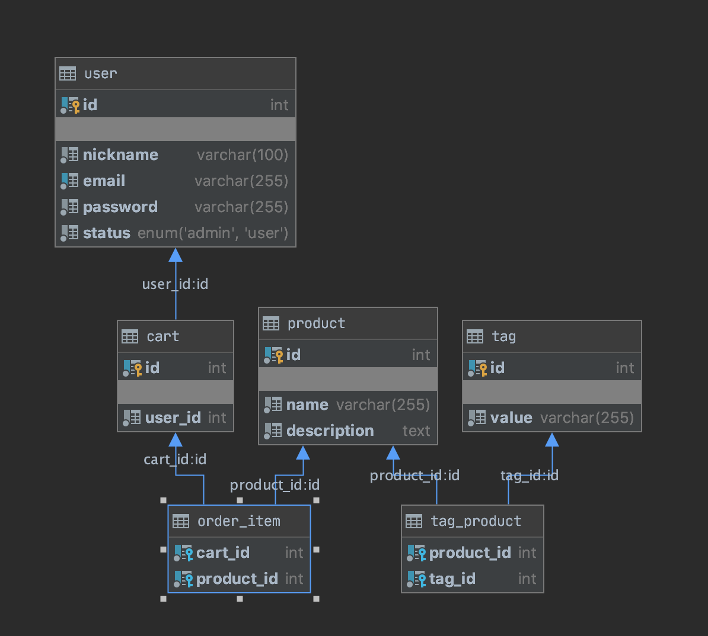

# TestTask
#### Database
* this application has current representation of `database`:

#### Users
* the application provides two roles of users: `ADMIN` and `USER`

#### Mail Sending
*  the `mailDev` was used to check how mail sending is work. 
Mails was configured to send emails to the localhost. 
MailDev can provide the messages that was confirmed on the localhost on port 1025.

